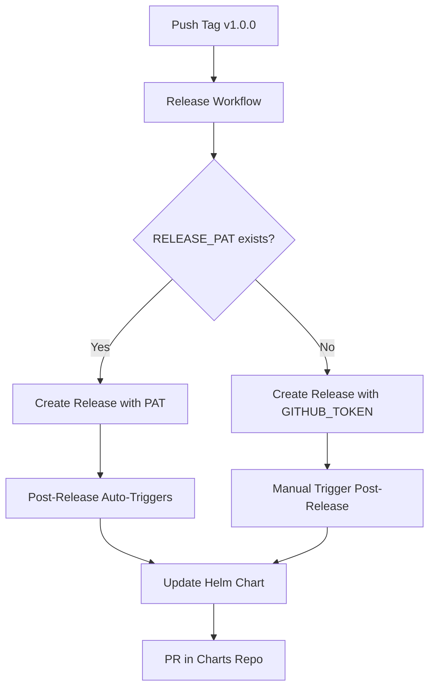

# Release Automation Architecture

This repository implements an elegant two-stage release automation with clean separation of concerns.

## Architecture Overview



## Workflows

### 1. Release Workflow (`release.yml`)
**Triggered by:** Git tag push (`v*`)  
**Responsibilities:**
- Build and test the operator
- Create multi-platform Docker images
- Push to GitHub Container Registry
- Create GitHub Release with automated release notes
- Run security scans (Trivy)

### 2. Post-Release Workflow (`post-release.yaml`)
**Triggered by:** Release published event OR manual dispatch  
**Responsibilities:**
- Trigger Helm chart update
- Future: notifications, documentation updates, etc.

### 3. Update Helm Chart (`update-helm-chart.yaml`)
**Triggered by:** Post-release workflow  
**Responsibilities:**
- Update appVersion in Chart.yaml
- Intelligent semantic version bumping
- Update charts repository README
- Create PR with all changes

## Elegant Design Benefits

1. **Separation of Concerns**: Each workflow has a single, well-defined responsibility
2. **Extensibility**: Easy to add new post-release tasks without modifying the release workflow
3. **Reliability**: Multiple fallback mechanisms for GitHub token limitations
4. **Testability**: Can manually trigger any stage for debugging

## Configuration

### Option 1: Full Automation (Recommended)
Create a `RELEASE_PAT` secret with a GitHub Personal Access Token that has `repo` scope.
This allows releases created by the workflow to trigger other workflows automatically.

### Option 2: Graceful Degradation
Without `RELEASE_PAT`, the system falls back to manually triggering the post-release workflow
using workflow_dispatch, ensuring the automation still works.

## Required Secrets

### CHARTS_REPO_TOKEN (Required)
Personal Access Token with permissions to create PRs in the charts repository.

**Creating the token:**
1. GitHub Settings → Developer settings → Personal access tokens
2. Generate new token (classic) with scopes:
   - `repo` (full control of repositories)
   - `workflow` (update GitHub Action workflows)
3. Add as repository secret: `CHARTS_REPO_TOKEN`

### RELEASE_PAT (Optional but Recommended)
Personal Access Token for this repository to enable workflow chaining.

**Creating the token:**
1. Same process as above but for this repository
2. Only needs `repo` scope
3. Add as repository secret: `RELEASE_PAT`

## Release Process

### Automatic Release (Recommended)

```bash
# Create and push a new tag
git tag v0.6.1
git push origin v0.6.1
```

This will:
1. Trigger the release workflow
2. Build and push Docker images
3. Create a GitHub release
4. Automatically trigger the Helm chart update
5. Create a PR in the charts repository

### Manual Trigger

If automation fails, you can manually trigger the chart update:

1. Go to Actions → "Update Helm Chart"
2. Click "Run workflow"
3. Enter the version (without 'v' prefix): `0.6.1`
4. Choose whether to bump chart version
5. Run workflow

## Troubleshooting

### Chart Update Not Triggering

1. **Check PAT permissions**: Ensure CHARTS_REPO_TOKEN has required permissions
2. **Check workflow logs**: Look for errors in the post-release workflow
3. **Manual trigger**: Use the workflow_dispatch option

### Workflow Fails with Permission Error

Ensure the PAT has:
- Access to both repositories
- `workflow` scope for triggering workflows
- `repo` scope for creating PRs

### Version Format Issues

- Tags should use format: `v0.6.1`
- The workflows automatically remove the 'v' prefix where needed
- Chart versions follow semantic versioning without 'v' prefix

## Testing the Automation

You can test without creating a real release:

```bash
# Test with a pre-release
git tag v0.6.1-beta.1
git push origin v0.6.1-beta.1
```

This creates a pre-release that won't affect the "latest" tag.

## Customization

### Changing Version Bump Strategy

Edit `update-helm-chart.yaml`:
```yaml
# Current: Patch bump (0.1.0 → 0.1.1)
NEW_CHART_VERSION="$MAJOR.$MINOR.$((PATCH + 1))"

# Alternative: Minor bump (0.1.0 → 0.2.0)
NEW_CHART_VERSION="$MAJOR.$((MINOR + 1)).0"
```

### Updating Additional Files

Add more sed commands in the "Update README.md" step to update other files:
```bash
# Update values.yaml
sed -i "s/tag: .*/tag: ${{ steps.version.outputs.version }}/g" "charts/vault-transit-unseal-operator/values.yaml"
```

## Security Considerations

- Never commit the PAT to the repository
- Rotate the PAT periodically
- Use the minimum required permissions
- Consider using GitHub App tokens for production environments